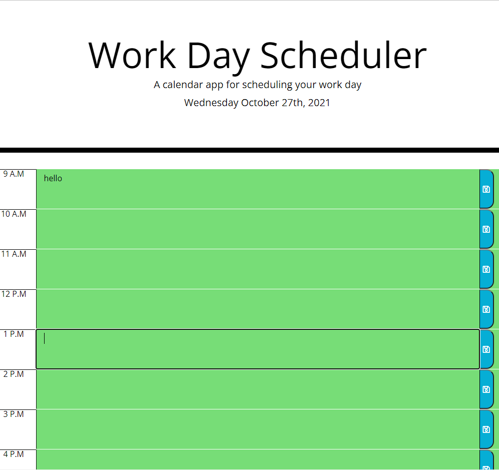

# 05 Third-Party APIs: Work Day Scheduler

## Your Task

I Created a simple calendar app that allows a user to save events depending on the hour of the day.
Green indicates that the time slot you are saving to is in the future. Red means the time slot is in the present and grey indicates the time slot is in the past.

## Mock-Up

